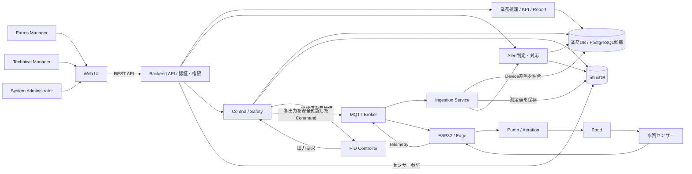
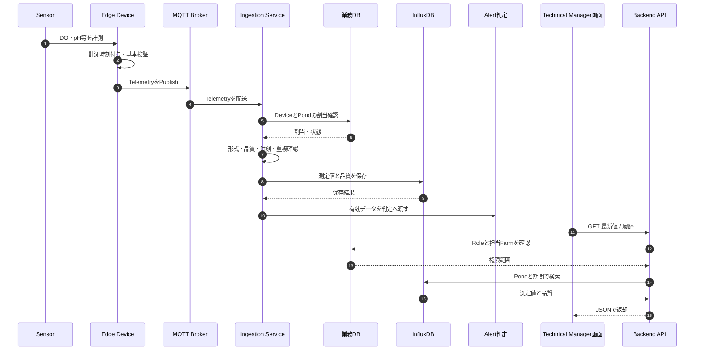
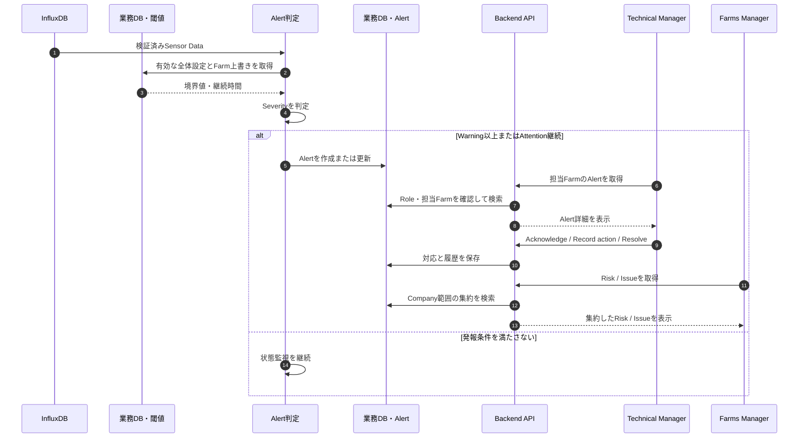
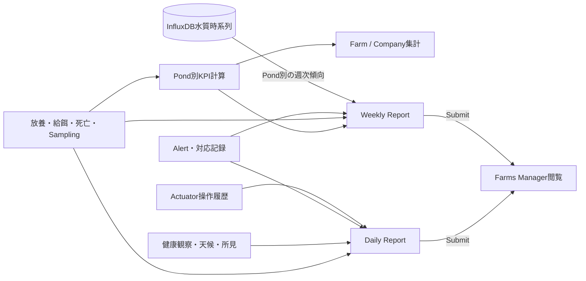
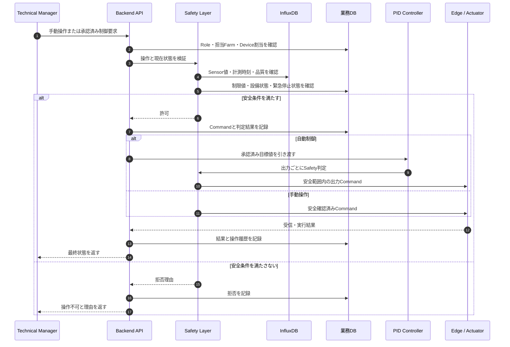
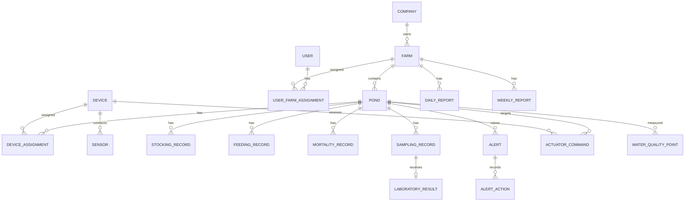

# バックエンド全体設計ダイアグラム

| 項目 | 内容 |
| --- | --- |
| 版 | 0.2（提出用ドラフト） |
| 更新日 | 2026-10-05 |
| 対応資料 | [全体設計](./backend_architecture_overview.md) / [API](./backend/api_design.md) / [データベース](./backend/database_design.md) |

図中のMQTT Broker、PostgreSQL、REST API、Control Serviceは論理構成または技術候補を表す。配置先・製品・プロセス分割の確定を意味しない。AI助言・予測・AI制御は今回の図に含めない。

## 1. システム全体構成

業務DBとInfluxDBには責務の異なるデータを保存する。AlertとReportは独立した処理である。実機へのCommand送信経路はMQTTを候補とし、機器仕様確定時に接続方式を決める。

## 2. IoTデータ受信と画面参照

IngestionがInfluxDBへの保存に失敗した場合は成功扱いせず、再送可能な状態を保つ。通信断時はEdgeが元の計測時刻で再送する。再送の保証範囲はBrokerとEdgeの仕様で決める。

## 3. Alertの発生と対応

外部通知の配送方式は未決定である。Alert自体は業務DBに残し、通知チャネルの成否とは分ける。

## 4. KPIとReport

Daily Reportには生センサー値を転記しない。Weekly ReportでもFarm平均の水質値は作らず、Pond別の傾向を示す。

## 5. Actuator操作と安全制御

上図のPID経路は自動制御時、直接送信は手動操作時を示す。実際の設備通信経路は機器仕様で確定する。Human OverrideとEmergency Stopは自動制御より優先する。

## 6. データ関係図

`WATER_QUALITY_POINT`のみInfluxDBの論理データで、他は業務DBの論理エンティティである。両DBの関連はアプリケーション内のID照合で実現し、DB間の外部キーは存在しない。列と制約は[データベース詳細設計](./backend/database_design.md)を参照する。
