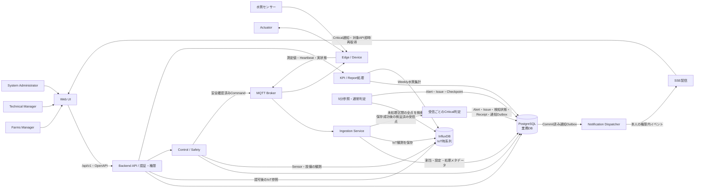
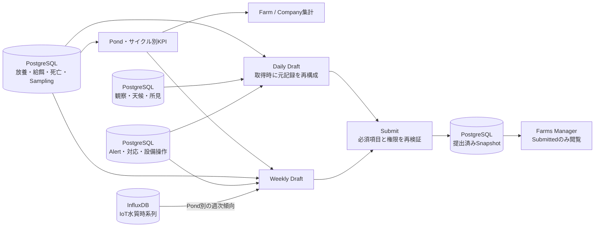
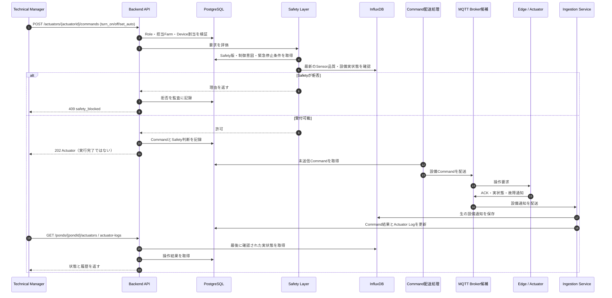
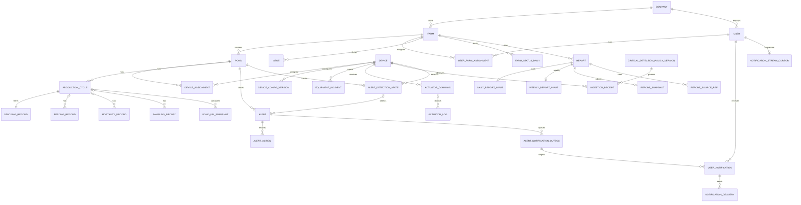

# バックエンド全体設計ダイアグラム

| 項目 | 内容 |
| --- | --- |
| 版 | 0.7（SSEによる管理画面内の即時通知） |
| 更新日 | 2026-10-06 |
| 対応資料 | [全体設計](./backend_architecture_overview.md) / [OpenAPI契約](./api/openapi.yaml) / [API詳細設計](./backend/api_design.md) / [データベース詳細設計](./backend/database_design.md) |

図は論理責務を示す。PostgreSQLとInfluxDBは採用方針、MQTT Brokerの製品・Cloud配置・プロセス分割は未決定である。Web向けのパスと入出力はOpenAPIを正とする。AI助言・予測・AI制御は対象外。

## 1. システム全体構成



IoTの生データはInfluxDB、マスタ・現場記録・Alert・Issue・Report・Command・監査はPostgreSQLに置く。PostgreSQLのIoT処理Receipt／Checkpointは再送・再処理のためのメタデータであり、測定値本文を持たない。Deviceから画面向けREST APIへ送信しない。

Criticalは受信ごと、Warning・Attention継続は5分ごとに判定する。両経路は共通の検知状態で二重発報を抑止する。通知配送はCommitを契機にSSEへ即時開始し、SSE受信時は画面内通知を表示して対象の既存APIを追加取得する。TMにはAlert参照、FMにはIssue参照を送り、SAには業務通知を送らない。ページを閉じている間の端末通知は行わない。Critical検知からActuatorへ自動操作する経路は設けない。

## 2. IoTデータ受信と画面参照

```mermaid
sequenceDiagram
  autonumber
  participant Device as Sensor / Edge
  participant Broker as MQTT Broker
  participant Ing as Ingestion Service
  participant PG as PostgreSQL
  participant IFX as InfluxDB
  participant Critical as 受信Critical判定
  participant Worker as 5分参照処理
  participant API as Backend API
  participant TM as Technical Manager

  Device->>Broker: Telemetry（元の計測時刻・Device ID）
  Broker->>Ing: 配送・再配送
  Ing->>PG: 当時のDevice設定・Pond割当を確認
  PG-->>Ing: 有効な対応関係
  Ing->>Ing: 形式・品質・時刻・Message IDを検証
  Ing->>PG: Receiptと点参照・閾値版を記録（生データなし）
  Ing->>IFX: Sensor点／Heartbeat／設備通知を保存
  IFX-->>Ing: 書込結果
  Ing->>Critical: 保存済み受信点を渡す（5分周期を待たない）
  Critical->>PG: Critical条件・検知状態を確認
  Critical->>PG: Critical証跡とReceipt判定完了を同一Transactionで保存
  loop 5分ごと
    Worker->>IFX: 未処理区間の全測定値を参照
    IFX-->>Worker: 観測値と品質
    Worker->>PG: 通常判定・区間補完・CheckpointをTransactionで保存
  end
  TM->>API: GET /ponds/{pondId}/sensors/current 等
  API->>PG: Role・担当Farm・Pond所属を検証
  PG-->>API: 許可範囲・有効閾値
  API->>IFX: 認可済みPondの最新値／履歴を検索
  IFX-->>API: 値・計測時刻・品質
  API-->>TM: OpenAPIのschemaで返す
```

通信断でEdgeが再送しても元の計測時刻を維持する。InfluxDB書込とPostgreSQL更新は単一Transactionにできないため、Message IDとCheckpointで再処理可能にする。書込失敗を成功として扱わず、欠損を架空値で補わない。`x-refresh-interval-seconds: 300`の画面APIはフロントが5分ごとに再取得する。

Critical判定失敗時も受信完了扱いにせず、保存済み点と未完了Receiptで再試行する。再送済みでもCritical判定未完了なら読み飛ばさない。無効・古い・順序逆転の点は即時発報から除外し、除外理由を記録する。

## 3. Alertの発生と対応

```mermaid
sequenceDiagram
  autonumber
  participant Ing as Ingestion Service
  participant Critical as 受信Critical判定
  participant Worker as 5分参照・通常判定
  participant IFX as InfluxDB
  participant PG as PostgreSQL
  participant API as Backend API
  participant TM as Technical Manager
  participant FM as Farms Manager
  participant Notify as Notification Dispatcher
  participant UI as Web画面

  UI->>API: GET /notifications/stream（追加API案・Cookie認証）
  API->>PG: Role・所属・本人の通知Cursorを確認
  API-->>UI: SSE接続・保存済み未受信通知を再送

  loop 有効な新規受信点ごと（InfluxDB保存成功後）
    Ing->>Critical: 検証済みSensor点・元の計測時刻
    Critical->>PG: 計測時点の閾値版・鮮度設定・検知状態を取得
    Critical->>Critical: Critical境界だけを判定
    alt 鮮度条件内の新規Critical
      Critical->>PG: 検知状態をロックしAlert作成または既存Alert昇格
      Critical->>PG: Issue・Anomaly・Outbox・Receiptを同一Transactionで保存
      Notify->>PG: Commit済みOutboxを取得（5分周期を待たない）
      Notify->>PG: TM／FM別通知・Sequence・宛先配送依頼を保存
      Notify->>API: 権限内のCritical通知をSSE配信へ渡す
      API-->>UI: event critical（notificationId・対象参照）
      UI->>UI: Critical通知を即時表示
      UI->>API: 対象の既存Alert／Issue APIを即時取得
      API->>PG: 現在の所属を確認して詳細を取得
      API-->>UI: 許可範囲の最新情報
      Note over Notify,UI: 接続中の画面内通知。未接続は保存して再接続時に再送
    else 非Criticalまたは即時判定対象外
      Critical->>PG: 判定完了または除外理由をReceiptへ保存
    end
  end

  loop 5分ごと
    Worker->>PG: 前回Checkpoint・検知状態・対象点の閾値版を取得
    PG-->>Worker: 未処理区間・共通値とFarm上書き
    Worker->>IFX: 未処理区間のSensor全点を検索
    IFX-->>Worker: 測定値・計測時刻・品質
    Worker->>Worker: Warning・Attention継続・回復・過去区間を判定
    alt 通常発報または区間補完
      Worker->>PG: 共通検知状態をロックしAlert・Anomaly・Issueを更新
      Note over Worker,PG: 既存Criticalを重複発報・重大度降格しない
    end
    Worker->>PG: 成功した区間のCheckpointを進める
  end
  TM->>API: GET /alerts / GET /alerts/{alertId}
  API->>PG: 担当Farmを検証してAlertを取得
  API-->>TM: Alertと対応履歴
  TM->>API: POST acknowledge / actions / resolve
  API->>PG: 状態遷移・対応・監査を保存
  FM->>API: GET /issues / GET /issues/{issueId}
  API->>PG: Company配下のIssueを取得
  API-->>FM: 生のSensor値を除いた集約ビュー
```

5分Checkpointは通常判定のAlert・Issue等と同じPostgreSQL Transactionで進める。受信Critical判定はReceiptを更新し、このCheckpointを進めない。再試行では同じ異常を重複発報しない。閾値の変更は以後に計測された点へ適用し、過去のAlertを上書きしない。Sensor Offlineは無受信時間から5分周期で判定する。Critical通知はSSEで接続中の画面へ5分待機を挟まず配信し、通常の5分再取得も継続する。通知用APIは追加案で、SSE接続と画面内通知の実装が前提。利用者ごとに送信・クライアント受信・既読を分け、通知の既読ではAlertを解決しない。未接続時は通知を保存して再接続時に再送する。

## 4. KPIとReport



BiomassはPond値を合計し、Survival RateとFCRは分子・分母から再計算する。Farm／CompanyのABW・ADG平均を作らない。Daily Reportへ生Sensor値を転記せず、Weekly ReportにはPond別の派生集計のみを載せる。提出後はSnapshotを返し、元記録の訂正・遅延IoTデータで暗黙に内容を変えない。放養記録の登録APIは現行OpenAPI未定義。

## 5. Actuator操作と安全制御



設備へのCommand経路とACK形式は実機仕様で確定する。Auto中の手動操作はManual Overrideとなる。PIDとEmergency Stopは安全制御の内部設計対象だが、その設定・承認・停止操作の公開APIは現行OpenAPIにない。PID出力もSafety Layerを通す。実状態未受信時は`off`や`fault`を推測で返さない。

## 6. データ関係図

以下はPostgreSQLの主要関係である。`REPORT`はDaily／Weekly共通の基底テーブルで、提出済み内容は`REPORT_SNAPSHOT`に固定する。図にない細部の列・索引・設定版は[データベース詳細設計](./backend/database_design.md)を参照する。



InfluxDB側の論理系列は`sensor_readings`、`device_heartbeats`、`actuator_feedback`。PostgreSQLのDevice割当・設定履歴と、InfluxDBのDevice／Pondタグ・計測時刻をアプリケーションで照合する。両DB間にFKは存在しない。`ISSUE.source_id`はAlertや設備Incident等を参照する業務上の関連であり、参照先が複数テーブルにまたがるため通常の単一FKとして図示しない。

Receiptは各Eventの保存・Critical判定段階を管理し、検知状態は受信処理と5分処理で共有する。Outboxから利用者別通知とSSE配送メタデータを作り、再送・受信・既読を管理する。通知Cursorは本人の再接続時の再送位置である。どのテーブルにもIoTの生時系列を複製しない。図に省略した通知からFarm／Pond／Alert／IssueへのFKはDB設計第7.2節に記載する。
