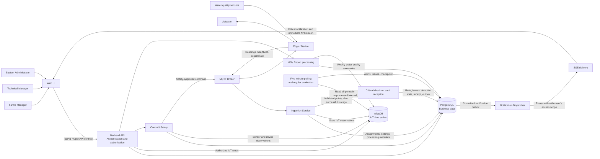
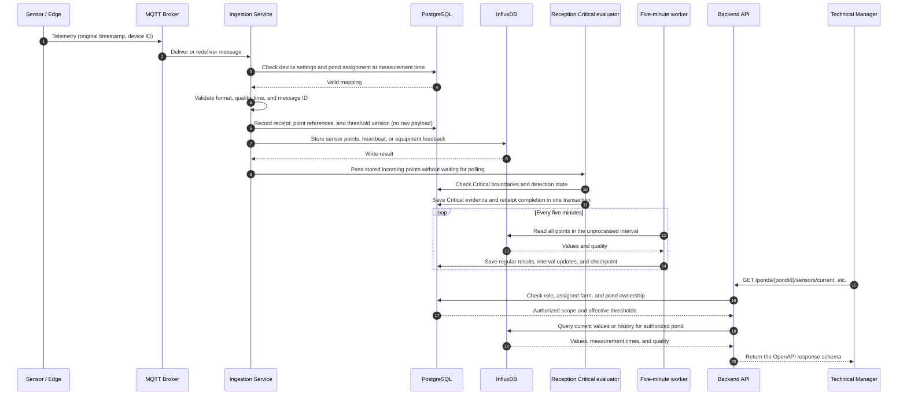
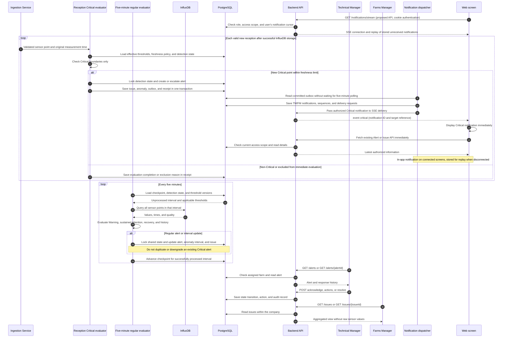
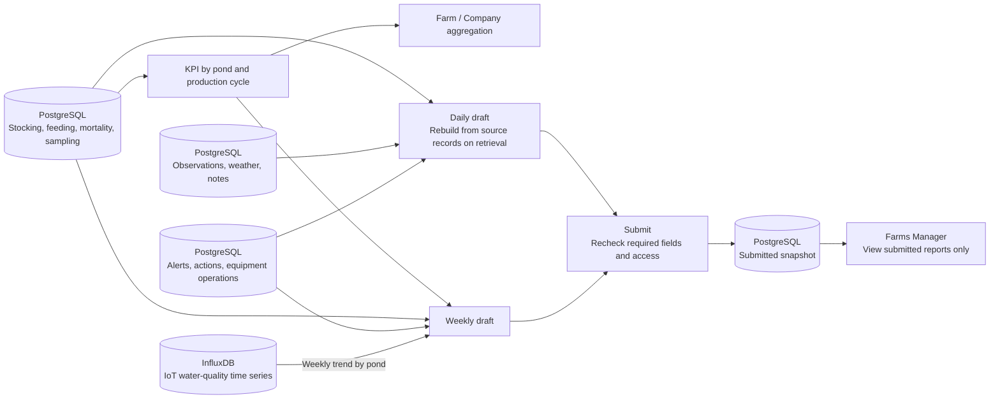
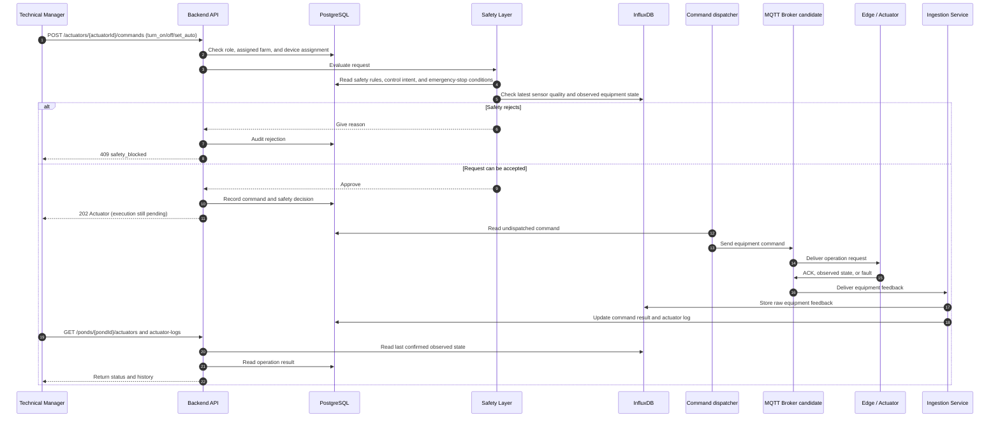
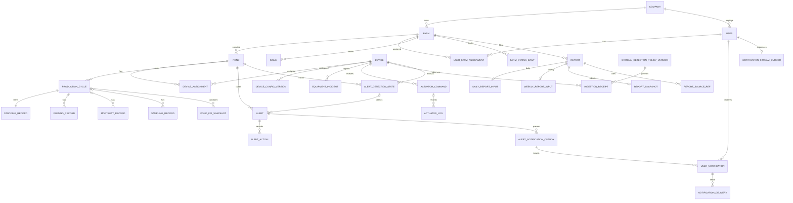

# Backend Architecture Presentation

Presentation companion to the [architecture diagrams](./backend_architecture_diagrams.md). The six diagrams below retain the same logical flows and data ownership, with labels translated into English. This is a design presentation, not a description of a deployed system. Estimated speaking time: 8-10 minutes.

Version: 0.7 - Critical evaluation on reception and immediate SSE notifications within the management screen. Updated: 2026-10-06. Slide numbers match the [Japanese version](./backend_architecture_presentation_ja.md).

## Slide 1 - What the backend is responsible for

**On-screen message:** One backend connects farm operations, IoT observations, and safe equipment control.

**Speaker notes:**

"This design is for a smart shrimp pond management system. Farm staff use a web interface to monitor ponds, record operations, respond to alerts, produce reports, and operate equipment. The backend has to connect those workflows to data from physical devices. I will follow the system from data collection through decisions and reporting, then finish with equipment control and the data model."

## Slide 2 - Overall architecture

**On-screen message:** Incoming data has a Critical evaluation path; committed Critical alerts trigger immediate user notifications.

**Speaker notes:**

"Start with the three user roles. The web API checks identity, role, and farm access. Sensors send observations through Edge, MQTT, and ingestion to InfluxDB; PostgreSQL stores business records. Each valid incoming point is checked for Critical conditions, while the five-minute worker handles regular alerts and summaries. After a Critical alert is committed, the dispatcher sends an SSE event to open screens. The screen displays an in-app notification and refreshes the relevant data immediately. Management is primarily computer-based, with notifications inside the web screen rather than device notifications while the page is closed. Both detection paths share state. Control and safety still handle equipment requests. These boxes describe logical responsibilities rather than deployment units."

**Transition:** "Next, I will follow one sensor reading through the system."

## Slide 3 - IoT ingestion and screen reads

**On-screen message:** Store observations on reception, check Critical, and keep regular polling on a separate five-minute schedule.

**Speaker notes:**

"A device sends a measurement with its original timestamp and identity. Ingestion checks its pond assignment, validates it, and stores it in InfluxDB. Critical evaluation then runs without waiting for the five-minute worker. Receipt metadata tracks storage and evaluation for retries. Delayed or invalid points do not trigger immediate alerts about current danger. The API checks farm access before returning data. Regular refresh remains every five minutes, with an additional immediate refresh when a Critical SSE event arrives. The measurement and transmission intervals remain device settings."

**Transition:** "Once observations are stored, the next question is how they become actionable alerts."

## Slide 4 - Critical detection, immediate notification, and regular evaluation

**On-screen message:** Critical is checked on reception and immediately notified; Warning and sustained Attention are evaluated every five minutes.

| Processing | Timing |
| --- | --- |
| Device measurement and MQTT transmission | Device settings; not defined by the five-minute worker |
| InfluxDB storage | On reception, after validation |
| Critical threshold evaluation | Each valid new sensor point after successful storage |
| Critical notification | Start delivery as soon as the alert transaction commits |
| Warning and sustained Attention | Every five minutes, using all unprocessed points and prior interval state |
| Screen updates | Regular five-minute refresh, plus an immediate refresh on a Critical SSE event |

The two loops in the diagram run on independent schedules. The five-minute loop does not have to finish before Critical evaluation or notification can run.

**Speaker notes:**

"The first loop checks each valid incoming sensor point for Critical conditions. If a threshold is crossed, the backend commits the alert and starts notification delivery immediately. SSE tells a connected screen to display an in-app notification and refresh its data. When the page is closed, we do not send device notifications; stored notifications are available on reconnection. The second loop runs every five minutes and checks all unprocessed points for Warning and sustained Attention. Shared state prevents duplicate alerts. Technical Managers receive Alert references, while Farms Managers receive Issue references without raw readings. We record delivery, client receipt, and reading separately; reading a notification does not resolve the alert."

**How to explain this diagram:**

1. Point to the first loop: reception, Critical boundary check, and alert commit.
2. Follow the dispatcher to the connected web screen: in-app notification begins without a five-minute wait; disconnected users receive stored notifications on reconnection.
3. Point to the second loop: regular evaluation uses the whole interval, including continuation from the previous run.
4. Finish with the manager actions: acknowledgment and resolution are recorded separately from notification receipt.

**Timing example:** If the regular worker runs at 10:00 and a valid Critical reading arrives at 10:01, the backend checks and stores it on reception, then starts notification delivery. It does not wait for the 10:05 run. The next regular run adds interval information without creating a duplicate alert.

**Transition:** "The same data also supports operational indicators and reports."

## Slide 5 - KPIs and reports

**On-screen message:** Drafts use current source records; submitted reports preserve a fixed snapshot.

**Speaker notes:**

"Operational records in PostgreSQL provide the basis for pond and production-cycle KPIs. Daily reports combine those records with observations and alert actions. Weekly reports add water-quality trends derived from InfluxDB. Farm and company totals are calculated from the underlying pond data; ratio metrics are recalculated from their components. Before submission, the report is a draft assembled from current records. At submission, we save a snapshot in PostgreSQL. Later corrections or delayed device data do not silently change what was submitted. The current OpenAPI does not yet define a write endpoint for stocking records."

**Transition:** "Now I will move from monitoring and reporting to an action that affects physical equipment."

## Slide 6 - Actuator command and safety

**On-screen message:** A command is checked before dispatch; acceptance is not proof of execution.

**Speaker notes:**

"A Technical Manager can request an actuator command through the existing API. First, the backend checks the user's authority and the device assignment. The Safety Layer then reads configured rules from PostgreSQL and recent sensor and equipment observations from InfluxDB. It may reject the request with a reason. If it accepts, the API returns HTTP 202 and an Actuator object. That means the request was accepted, not that the device has already completed it. The command is delivered asynchronously; feedback later updates the command result and visible status. An alert may prompt the manager to act, but an alert is not required to operate an actuator."

**Transition:** "The final diagram shows why the two databases have different roles."

## Slide 7 - Data relationships

**On-screen message:** PostgreSQL models operational relationships; InfluxDB holds device time series.

**Speaker notes:**

"PostgreSQL models companies, farms, users, ponds, production cycles, and operations. Device history preserves the mapping at measurement time. Receipt metadata tracks Critical evaluation, shared detection state prevents duplicates, and the outbox creates recipient notifications. Stream cursors support replay, and SSE delivery records track retries for each user. These tables store notification metadata rather than raw telemetry. InfluxDB still holds sensor readings, heartbeats, and actuator feedback. The application links the databases using identifiers and timestamps, without cross-database foreign keys."

**Transition:** "To close, I will summarize the design decisions and the remaining implementation choices."

## Slide 8 - Key decisions and next questions

**On-screen message:** Critical uses reception-based detection and immediate notification; regular evaluation remains every five minutes.

**Speaker notes:**

"The central decisions are OpenAPI, PostgreSQL for business data, and InfluxDB for observations. Critical is checked on reception and triggers immediate SSE delivery to connected screens; regular evaluation remains every five minutes. The design includes authorized recipients, retries, replay, and separate receipt and read status. New notification APIs and frontend integration must be added before implementation. We do not send device notifications while the page is closed; stored notifications are available when the user reconnects. Deployment, device protocols, retention, PID, and emergency-stop details remain to be confirmed. Critical does not automatically operate equipment, and AI remains outside scope."

**Implementation status:** Notification endpoints, including `/notifications/stream`, are additional API proposals in [API design section 11.4](./backend/api_design.md). They are not part of the existing 74 OpenAPI operations. The diagrams describe the intended integration; frontend files have not been changed.

## Short answers for questions

- **Why two databases?** Device readings are time series in InfluxDB. Users, permissions, farm records, alerts, reports, and commands have relational business rules in PostgreSQL.
- **Do devices call the web API?** No. The current design sends device messages through MQTT to the ingestion service. The web API serves users and frontend screens.
- **Does HTTP 202 mean the actuator changed state?** No. It means the command was accepted. A later device acknowledgment and observed state provide the result.
- **Does safety check whether an alert is open?** It checks current observations and configured rules. Alert lifecycle state is stored in PostgreSQL, and an open alert is not a prerequisite for a command.
- **Is the system fully specified for deployment?** No. The diagrams define logical behavior. Broker selection, cloud placement, and device protocol details remain to be decided.
- **How does the user see Critical immediately?** A connected screen displays an in-app notification on an SSE event and refreshes the relevant API immediately. We do not notify users immediately while the page is closed or disconnected; stored notifications are available on reconnection.
- **Does the five-minute worker check only the final point?** No. It checks all unprocessed measurements and carries forward the previous interval's state for duration rules.
- **Is this notification behavior already running?** This is the design. The additional notification APIs and the frontend notification handlers still need implementation; the existing frontend files are unchanged.
- **Does reception-based detection observe danger between measurements?** No. It checks arriving observations. Detection time still includes the device measurement interval, transmission, and processing time.

Source of truth: [OpenAPI contract](./api/openapi.yaml), [architecture overview](./backend_architecture_overview.md), [API design](./backend/api_design.md), and [database design](./backend/database_design.md).
