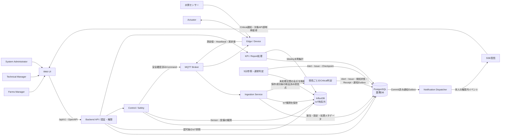
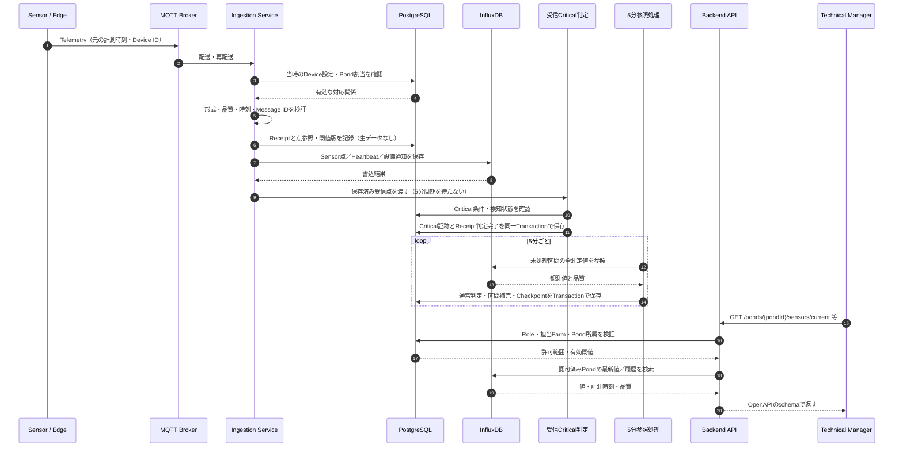
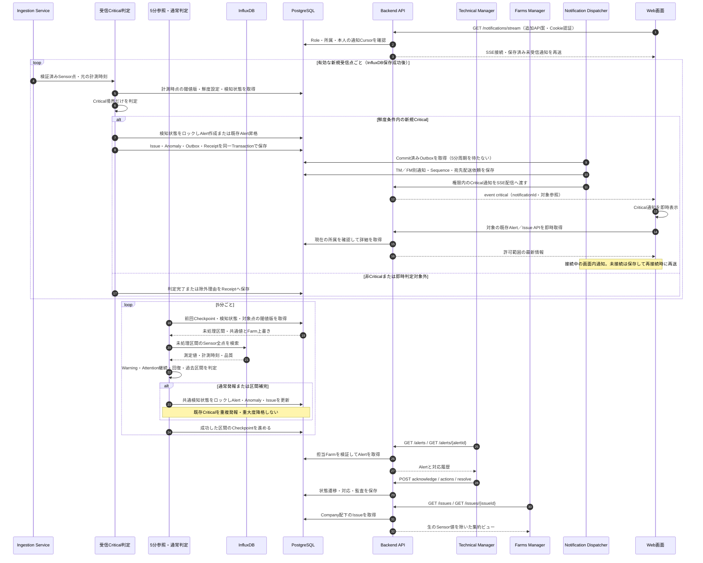
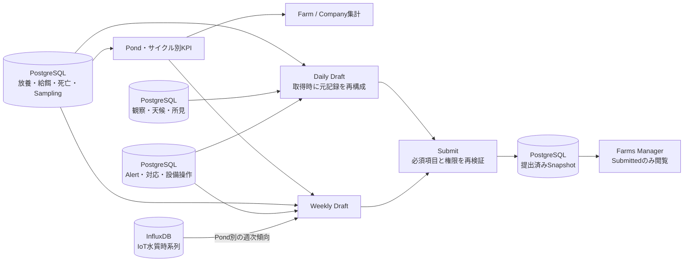
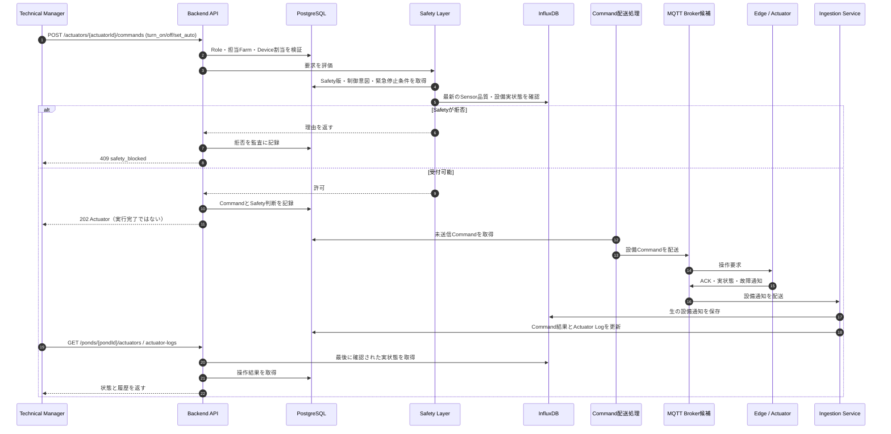
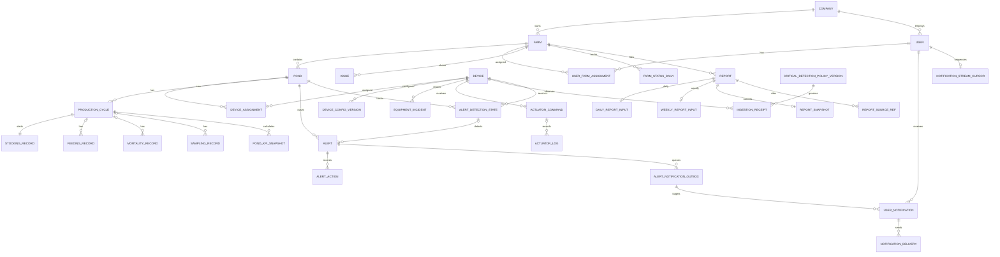

# バックエンドアーキテクチャー発表資料（日本語版）

この資料は[英語版](./backend_architecture_presentation_en.md)とスライド番号・説明順を揃えている。図は[全体設計ダイアグラム](./backend_architecture_diagrams.md)の6図に対応する。実装済みシステムではなく設計を説明する資料である。想定発表時間は8〜10分。

版：0.7（受信ごとのCritical判定・SSEによる管理画面内の即時通知）。更新日：2026-10-06。

## Slide 1 - バックエンドの役割

**画面で伝える要点：** 養殖現場の業務、IoT観測、設備の安全な操作をバックエンドがつなぐ。

**発表原稿：**

「この設計は、エビ養殖池の管理システムを対象にしています。現場の担当者はWeb画面から池の状態を確認し、作業を記録し、アラートに対応し、レポートを作成し、設備を操作します。バックエンドは、こうした業務と実際のデバイスから届くデータをつなぐ役割を担います。ここから、データ受信、判定とレポート、設備制御、最後にデータ構造という順番で説明します。」

## Slide 2 - 全体構成

**画面で伝える要点：** 受信データをCritical専用の経路で判定し、Critical保存後は利用者へ即時通知する。

**発表原稿：**

「利用者には3つの役割があり、Web APIが本人・役割・担当Farmを確認します。センサー値はEdge、MQTT、受信処理を通ってInfluxDBへ届き、PostgreSQLには業務記録を保存します。有効な受信点ごとにCriticalを判定し、5分Workerは通常判定と集計を担当します。Critical保存後はDispatcherがSSEで開いている画面へ通知します。画面は画面内通知を表示し、対象情報をすぐに再取得します。パソコンでの管理を基本とし、通知は管理画面内で確認します。ページを閉じている間の端末通知は行いません。両判定で検知状態を共有し、設備操作はControl / Safetyが扱います。箱は論理責務を示しています。」

**次へのつなぎ：** 「続いて、センサーの測定値が1件届いた場合の流れを見ます。」

## Slide 3 - IoTデータ受信と画面参照

**画面で伝える要点：** 観測値を受信ごとに保存してCriticalを確認し、通常の5分参照は別の周期で実行する。

**発表原稿：**

「デバイスは元の計測時刻とIDを付けて測定値を送ります。受信処理で割当と内容を検証し、InfluxDBへ保存した後に5分周期を待たずCriticalを判定します。Receiptが保存と判定の進捗を追跡し、失敗時は再試行します。古い点や無効な点は現在の危険として即時発報しません。APIは担当Farmを確認してデータを返します。通常の画面更新は5分周期ですが、CriticalのSSE受信時には追加で即時取得します。測定・送信周期はデバイスの設定として残ります。」

**次へのつなぎ：** 「保存した測定値から、どのようにアラートを出すかを説明します。」

## Slide 4 - Criticalの即時判定・通知と通常判定

**画面で伝える要点：** Criticalは受信ごとに判定して即時通知し、Warning・Attention継続は5分ごとに判定する。

| 処理 | タイミング |
| --- | --- |
| デバイスの測定・MQTT送信 | デバイス設定による。5分Workerが測定周期を決めるわけではない |
| InfluxDB保存 | 受信・検証ごと |
| Critical閾値判定 | 保存成功後、有効な新規Sensor点ごと |
| Critical通知 | AlertのTransaction確定後、すぐに配送を開始 |
| Warning・Attention継続 | 5分ごとに未処理区間の全点と前周期の継続状態を確認 |
| 画面更新 | 通常は5分ごと。CriticalのSSE受信時は追加で即時更新 |

図の2つのloopは独立した周期で動く。5分処理の終了を待ってCritical判定や通知を開始するわけではない。

**発表原稿：**

「最初のloopでは、有効な受信点ごとにCritical条件を確認します。閾値を超えていればAlertを保存し、すぐ通知配送を開始します。SSEは接続中の画面へ通知し、画面内表示と情報の再取得を行います。ページを閉じている間は端末通知を行わず、保存済み通知を次回接続時に確認します。2つ目のloopは5分周期で動き、未処理区間の全点からWarningとAttention継続を判定します。両経路は検知状態を共有して重複を防ぎます。TMにはAlert参照、FMには生測定値を含まないIssue参照を送ります。配送・クライアント受信・既読は別に記録し、通知の既読だけでAlertを解決しません。」

**図を説明する順番：**

1. 最初のloopを指し、受信・Critical閾値判定・Alert保存を説明する。
2. Dispatcherから接続中のWeb画面への矢印を追い、画面内通知は5分待たずに開始し、未接続時は保存して再接続時に確認すると説明する。
3. 2つ目のloopを指し、通常判定は前周期の継続状態を含めて区間全体を見ると説明する。
4. 最後に担当者の操作を説明し、確認・解決と通知受信は別の記録であることを伝える。

**時刻の例：** 10:00に通常Workerが動き、10:01に有効なCritical値が届いた場合、受信時に判定・保存して通知配送を開始する。10:05の通常処理は待たない。次の通常処理では異常区間の情報を補完し、同じAlertを重複作成しない。

**次へのつなぎ：** 「同じデータを、KPIとレポートにも活用します。」

## Slide 5 - KPIとレポート

**画面で伝える要点：** 下書きは元データから構成し、提出した内容はSnapshotとして固定する。

**発表原稿：**

「PostgreSQLの現場記録をもとに、池と養殖サイクルごとのKPIを計算します。Daily Reportには現場記録、観察、アラート対応を使います。Weekly Reportには、InfluxDBの水質データから作った池ごとの傾向も加えます。FarmやCompanyの合計は池の値から求め、比率の指標は元の分子と分母から再計算します。提出前のReportは元データから作る下書きです。提出時には内容をPostgreSQLへSnapshotとして固定します。その後、現場記録の修正やIoTデータの遅延到着があっても提出内容が勝手に変わらないようにします。なお、放養記録の登録APIは現行OpenAPIでは未定義です。」

**次へのつなぎ：** 「次は、監視から一歩進んで、設備を動かす場合です。」

## Slide 6 - Actuator操作と安全制御

**画面で伝える要点：** 操作要求は配送前に安全確認し、受付と実機の動作完了を区別する。

**発表原稿：**

「Technical Managerは既存のAPIから設備操作を要求できます。まずバックエンドが操作権限とデバイスの割当を確認します。次にSafety LayerがPostgreSQLの安全ルールと、InfluxDBにある最新のセンサー品質・設備実状態を確認します。危険なら理由を付けて拒否します。許可した場合、APIはHTTP 202とActuator情報を返します。これは要求を受け付けたという意味で、実機の操作完了ではありません。Commandは非同期に設備へ配送し、後から届くACKや実状態で結果を確認します。アラートを見て操作する場合もありますが、アラートの存在は操作の必須条件ではありません。」

**次へのつなぎ：** 「最後の図で、2つのデータベースの役割を確認します。」

## Slide 7 - データ関係図

**画面で伝える要点：** PostgreSQLは業務上の関係を管理し、InfluxDBはデバイスからの時系列を管理する。

**発表原稿：**

「PostgreSQLはCompany、Farm、User、Pond、養殖サイクル、現場記録を管理します。Device履歴が計測時点の対応を残します。ReceiptでCritical判定を追跡し、検知状態で重複を防ぎ、Outboxから利用者別通知を作ります。通知Cursorは再接続時の再送、SSE配送記録は利用者別の再試行に使います。これらは通知の管理情報で、生の時系列は複製しません。InfluxDBは引き続き測定値、Heartbeat、設備通知を保存し、IDと時刻で両DBを照合します。」

**次へのつなぎ：** 「最後に、確定している設計方針と今後の確認事項をまとめます。」

## Slide 8 - 設計方針と今後の確認事項

**画面で伝える要点：** Criticalは受信ごとの判定と即時通知、通常判定は5分周期という役割分担である。

**発表原稿：**

「OpenAPIを画面との契約にし、PostgreSQLで業務データ、InfluxDBで観測値を扱います。Criticalは受信ごとに判定してSSEで接続中の画面へ即時配送し、通常判定は5分周期を続けます。宛先の権限確認、再送、再接続、受信と既読の記録も設計しました。実装には通知用の新規APIとフロント連携を追加する必要があります。ページを閉じている間の端末通知は行わず、保存済み通知を再接続時に確認します。配置、実機プロトコル、保存期間、PID、緊急停止の詳細は今後確認します。Criticalによる自動設備操作とAIは今回の変更に含めません。」

**実装状況：** `/notifications/stream`などの通知用APIは[API設計第11.4節](./backend/api_design.md)の追加案であり、既存OpenAPIの74操作には含まれていない。図は実装時に必要な連携を示す。frontendのファイルは変更していない。

## 質疑応答用の短い回答

- **なぜDBを2つ使うのか？** デバイスの測定値は時系列としてInfluxDBで扱う。ユーザー、権限、現場記録、アラート、レポート、コマンドは業務上の関係があるためPostgreSQLで扱う。
- **デバイスはWeb APIを呼ぶのか？** 呼ばない。現在の設計ではMQTTを経由してIngestion Serviceへ送る。Web APIは画面と利用者向けである。
- **HTTP 202なら設備は動作済みか？** いいえ。要求を受け付けた段階であり、後続のACKと実状態で結果を確認する。
- **操作時には未解決のアラートが必要か？** 必要ではない。Safety Layerは最新の観測値と設定済みルールを確認する。アラートの対応状態はPostgreSQLで管理する。
- **実装・配置まで決まっているか？** まだ決まっていない。図は論理設計であり、Broker製品、クラウド配置、実機プロトコルなどは今後確定する。
- **Criticalをどうやってすぐ表示するか？** 接続中の画面はSSE受信時に画面内通知を表示して対象APIを即時取得する。ページを閉じている間や通信断中は即時通知せず、保存済み通知を再接続時に確認する。
- **5分処理は最後の1点だけを見るのか？** 未処理区間の全測定値を確認する。継続時間の判定には前周期の状態も引き継ぐ。
- **通知はすでに動いているのか？** 現在は設計である。通知用の追加APIと画面側の受信処理は実装が必要で、既存frontendのファイルは変更していない。
- **測定と測定の間の異常も即時に分かるか？** 分からない。届いた観測値を判定する方式なので、測定周期、通信時間、処理時間による遅延は残る。

設計上の正本：[OpenAPI契約](./api/openapi.yaml)、[全体設計](./backend_architecture_overview.md)、[API詳細設計](./backend/api_design.md)、[データベース詳細設計](./backend/database_design.md)。
